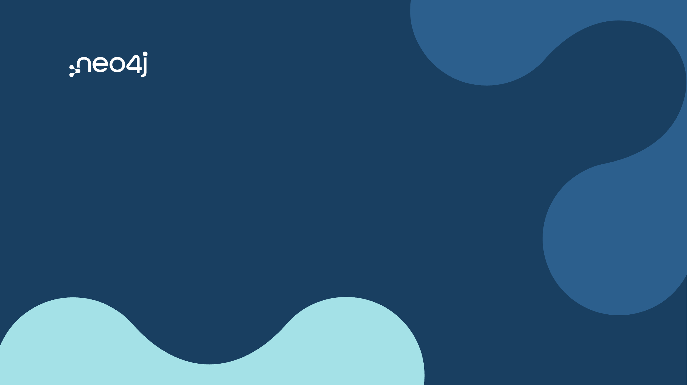
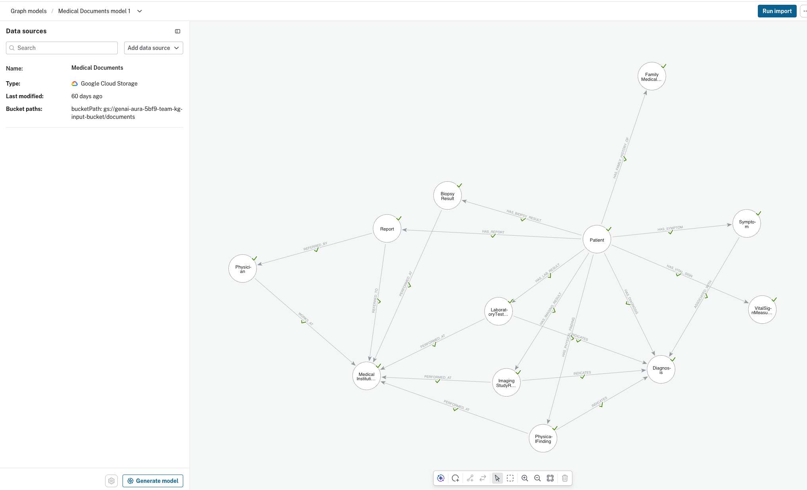
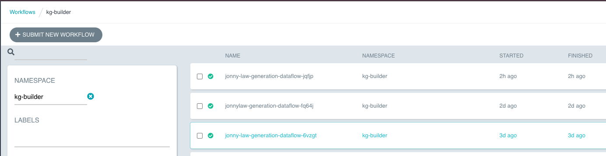
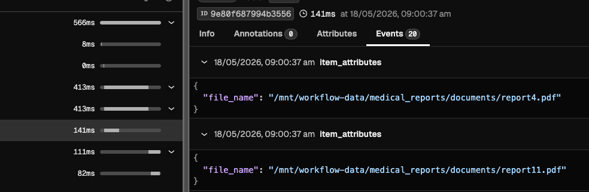
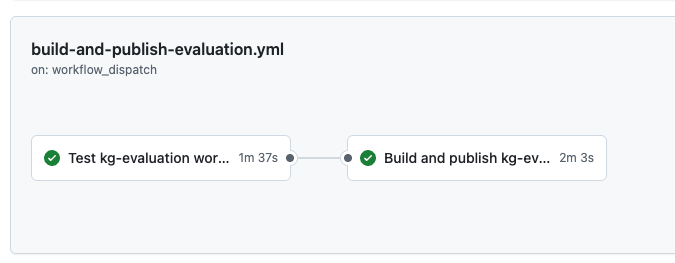
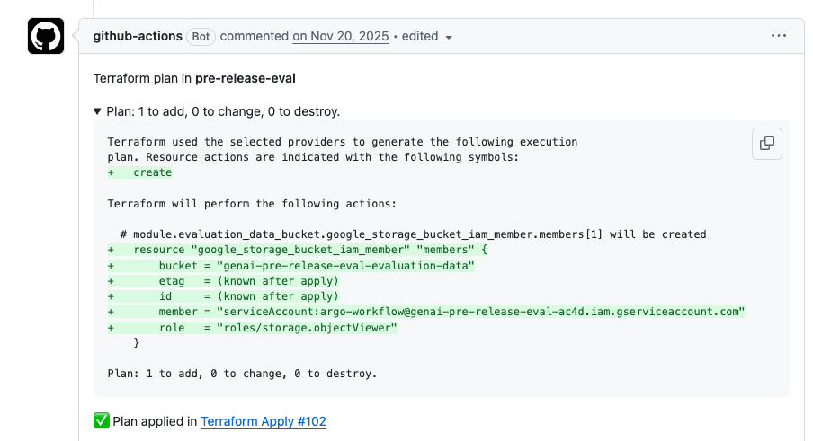

<!-- _class: lead -->

# Engineering a Scalable Knowledge Graph Builder on Neo4j Cloud

Dr. Jonny Law

<a href="https://github.com/jonnylaw">

</a>
<a href="https://jonnylaw.rocks">

</a>

---

# Who am I?

:::: columns

::: col

:::

::: col

:::

::::

---

# What am I going to talk about?

:::: columns
::: col
* Introduction to Neo4j, Knowledge Graphs and Document Intelligence
* How we balance experimentation and production requirements to build our Knowledge Graph Builder
:::
::: col

:::
::::

---

<!-- 

# Motivation

* LLMs can hallucinate
* RAG is a technique for augmenting the output of a language model with additional external context
* Graphs can provide additional context, relationships and semantic meaning 
* We need a way to build Knowledge Graphs automatically and at scale 

-->

# Ask the LLM

* **[User]** Is anyone from Neo4j speaking at the 2026 AI In Production Conference?
* **[LLM]** I'm afraid my knowledge cutoff is 2025, is there anything else I can help you with?

---

<!-- 
We can use RAG to augment the output of a language model with additional external context 

Vector embeddings can be used to find the most relevant documents in a knowledge base, but they lack semantic relationships between documents so we could end up fetching the wrong documents
-->

# Retrieval Augmented Generation (RAG)

* **[User]** Let's use a vector embedding search to fetch additional context 
* **[LLM (Thinking)]** I realise I have a relevant document in my knowledge base, let me fetch it for the user and augment my response
* **[LLM (Response)]** The 2026 AI In Production Conference will be hosted in Newcastle upon Tyne, UK by Jumping Rivers.

---

<!-- Graphs provide additional context, relationships and semantic meaning -->

# Graphs

Graphs are made up of **nodes** and **relationships**.


---

# GraphRAG

GraphRAG is like RAG - but we get additional context from a graph.


---

<!-- 
# Neo4j: Cypher

Cypher is a declarative, graph query language for Neo4j.

Cypher respects the [ISO GQL (Graph Query Language) standard](https://www.gqlstandards.org/). -->

# The Result

<style scoped>section { font-size: 22px; }</style>

* **[User]** Is anyone from Neo4j speaking at the AI In Production Conference?
* **[LLM (Thinking)]** I need to fetch the relevant documents from the graph, I will use the Text2Cypher tool to convert my natural language query into a Cypher query

    ```cypher
    MATCH (a:Person)-[:speaks_at]->(b:Conference)
    WHERE (a)-[:works_at]->(:Company {name: 'Neo4j'})
    RETURN a.name, b.name
    ```

    

* **[LLM (Response)]** Yes, Jonny Law is speaking at the AI In Production Conference.

---

# Diving In

* You're now an expert in Neo4j and a Knowledge Graph evangelist<sup>1</sup>
* Let's dive into how we built a production ready Knowledge Graph Builder

<div class="footnote">1. I have stickers for any Neo4j evangelists out in the audience</div>

---

# Building a Production Ready Knowledge Graph Builder

* Typical requirements of a production application
  - Secure
  - Reliable / Available
  - Scalable / Performant
  - Observable
  - Compliance
  - Useful for the user
* What's different about building an application incorporating AI?
  - You can do everything right - but it's still wrong sometimes

---

# Requirements and Constraints

* Our challenge is to build a **scalable** and **high quality** knowledge graph builder which is secure, reliable and easy to use
* One additional constraint is that we can't use the customer's data to train and improve our models
* Hence we have to build a **flexible** product which suits the customer's needs and can be easily adapted to new unforeseen use cases

---

<!-- 
- It's an ingestion and transformation pipeline. 
- We take unstructured text, chunk it, use LLMs to extract entities and relationships
- Resolve duplicates
- Push it to Neo4j
 -->

# The Knowledge Graph Builder


---

<!-- 
* The `Pipeline` is a chain of higher-order functions with no shared state
* Concurrent requests are batched and rate limited
* LLM results are cached to avoid redundant processing
* Reserved LLM quotas (GSU Generative AI Scale Unit)
 -->

# Efficiency & Scalability

```python
pipeline = (
    Pipeline.from_source("s3://documents/")
    .map(parse_document)
    .flat_map(partial(split_into_chunks, chunk_size=CHUNK_SIZE))
    .grouped(BATCH_SIZE)
    .flat_map_async(entity_extraction)
    .reduce(initial_value=entity_resolution_monoid.zero(),
            func=entity_resolution_monoid.combine)
    .map(prune_graph)
    .to_sink(ParquetSink("s3://output/graphs/"))
)
```

---

# Closing the Gap Between Experimentation and Production

:::: columns

::: col
* Enable rapid iteration and experimentation
* Focus on Developer Experience
* Make it easy to experiment using the production workflow
:::

::: col

:::

::::

---
<!-- Mise: There is no excuse for building poor quality developer experiences. 

- Mise can install all required tools (k3d, Argo Workflows, Arize Phoenix, gcloud, etc.) for local development
- set the appropriate environment variables
- Provide documented tasks for common operations 
- These can be documented for use by humans and AI
- We can use mise in the CI/CD pipeline to ensure the environment is consistent and reproducible
-->

# Development Speed

:::: columns

::: col
* Developers can onboard quickly and install all required tools using [mise](https://mise.jdx.dev/)
  - k3d, Argo Workflows, gcloud, argo cli...
* The workflow is written once and can be deployed to multiple environments, including locally using Argo Workflows running on `k3d`<sup>1</sup>
:::

::: col


:::

::::

<div class="footnote">1. <a href="https://12factor.net/codebase">The twelve-factor app 1: Codebase</a></div>

<!-- 
# Flexibility

* Graph Builder should work with multiple unstructured/semi-structured data sources (e.g. PDFs, Word documents, CSV files, etc.)
* Graph Builder should provide usable Knowledge Graphs for any domain (e.g. financial, legal, medical, etc.)
* Graph Builder should run wherever the customer has chosen to host their Neo4j Cloud instance
* The customer can configure the workflow to suit their needs -->

---

# Flexibility: Configuration Driven Pipelines

:::: columns

::: col
* KG Builder is a pipeline of higher-order functions with no shared mutable state orchestrated using [Argo Workflows](https://argoproj.github.io/argo-workflows/)
* Each stage has a fixed API but there is flexiblity on how to implement them
* We can provide configuration using `env` variables <sup>1</sup>
* We can swap out components without modifying the code <sup>2</sup>
:::

::: col
```yaml
embedder_provider: vertexai
entity_extractor_provider: vertexai
entity_resolver_settings:
  blocker_type: "schema_aware"
  matcher_type: "exact_property"
  clusterer_type: "transitive"
  fusioner_type: "property_preserving"
llm_rate_limit:
  max_rate: 48
  time_period_seconds: 1.0
  max_concurrency: 150
```
:::

::::

<div class="footnote">1. <a href="https://12factor.net/config">The twelve-factor app 3: Config</a><br/>2. <a href="https://12factor.net/backing-services">The twelve-factor app 4: Backing Services</a></div>

---

# Quality: Ensuring Quality is high through (offline) experimentation

* We don't have access to customer data so we can't directly validate the quality of generated knowledge graphs
* We have selected datasets which we can use for **offline evaluation** to iterate and improve the quality of extracted knowledge graphs

---

# Offline Evaluation: A Platform for Reproducible Experimentation

* We have developed a cloud-based platform for reproducible experimentation called **GenAI Cloud**
* It is used across the KG builder, Agents and Text2Cypher teams to evaluate and improve the quality of models
* We focused on ease-of-use and parity with production orchestration to ensure users are onboarded effectively and can reproduce experiments with confidence

---

<!-- 

- Google Cloud Storage for storing experiment datasets and results
- Github actions for building docker images with commit hash tagging for reproducibility
- Argo CD for managing k8s applications
- Argo Workflows for orchestration
-->

# The Stack

:::: columns
::: col
- Google Cloud Storage
- Github actions 
- Vertex AI experiment tracking
- Google Kubernetes Engine 
- Argo CD for managing k8s applications
- Argo Workflows for orchestration
:::
::: col

:::
::::

---

# Infrastructure as Code

:::: columns
::: col
- We use [Terraform](https://www.terraform.io/) in GitHub to define the infrastructure as code for the GenAI Cloud platform
- Anyone can contribute to the infrastructure by submitting a Terraform PR - must be approved by a maintainer
:::
::: col

:::
::::

---

# Custom Workflow submission CLI

:::: columns
::: col
- We have written a custom CLI to allow users to submit workflows to the GenAI Cloud platform with sensible defaults and validation.

:::
::: col

<video autoplay muted loop controls width="100%" style="max-height: 50vh;">                                     
  <source src="images/wf-submit-demo.mp4" type="video/mp4">                               
</video>
:::
::::


---

<!-- We use experiment tracking to evaluate the quality of models / parsing engines / entity resolution algorithms etc. -->

# Custom Experiment Tracking

:::: columns
::: col
- We have written a lightweight experiment tracking library
- The `tracker` is pluggable and can be extended to support other tracking systems
- This means we can change the tracking system without making large code changes
:::
::: col
```python
tracker = create_tracker(
    tracker_type="vertex_bigquery",
    experiment_name="my-experiment",
    project_id="my-project",
    bq_dataset_id="experiment_tracking"
)

with tracker:
  tracker.log_params({
        "learning_rate": 0.001,
        "batch_size": 128,
    })
    tracker.log_metric("accuracy", 0.95)
```
:::
::::

---
<!-- Video of the Knowledge Graph Builder in action -->

# So What: The Knowledge Graph Builder

<video autoplay muted loop controls width="100%" style="max-height: 50vh;">                                     
  <source src="images/kg-builder-demo.mp4" type="video/mp4">                               
</video>

---

<!-- _class: lead -->

# The Last Slide

**Me**: Jonny Law
**Company**: [Neo4j](https://neo4j.com)
**Neo4j GraphRAG Open Source**: [github.com/neo4j/neo4j-graphrag-python](https://github.com/neo4j/neo4j-graphrag-python)
**Blog**: [jonnylaw.rocks](https://jonnylaw.rocks)
